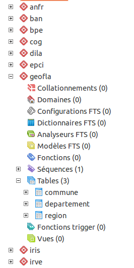
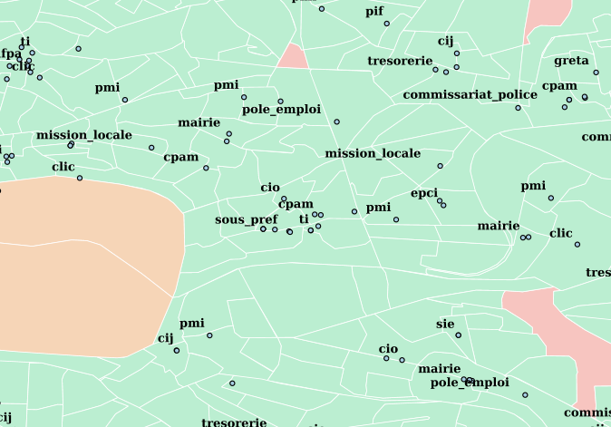
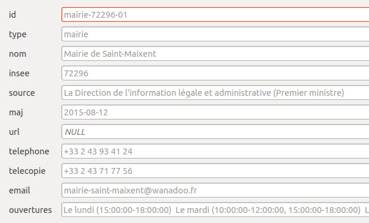
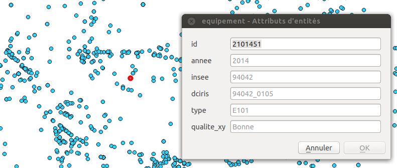
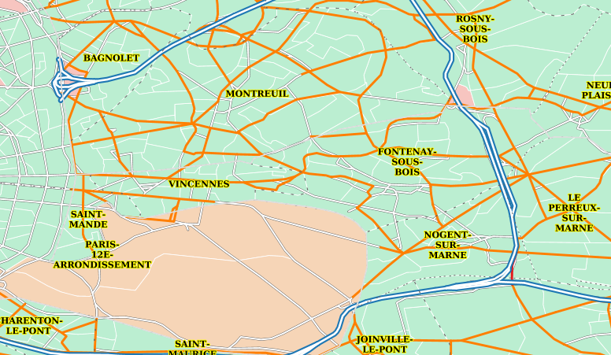
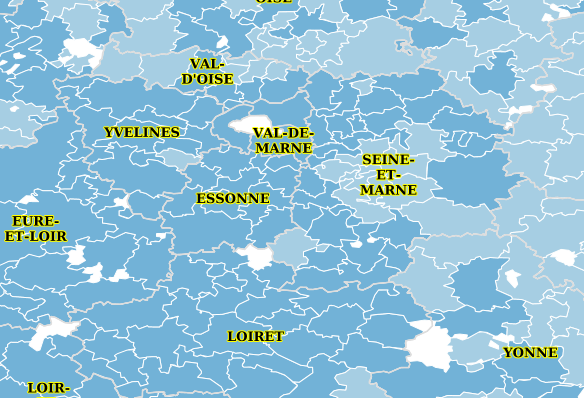
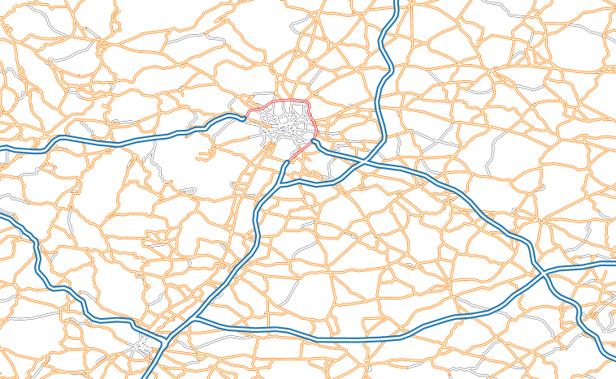
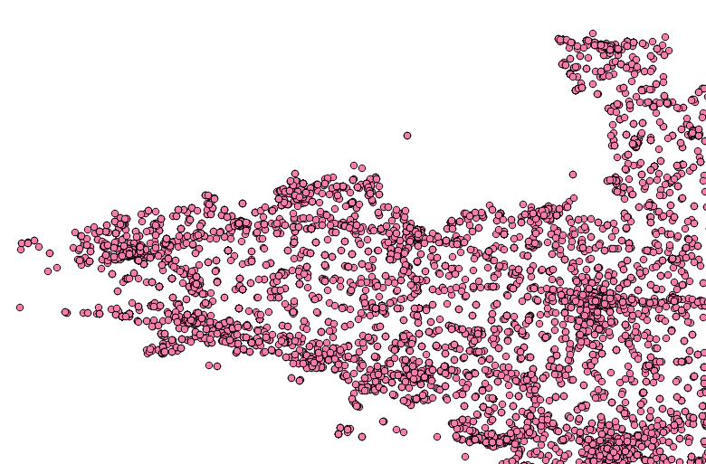
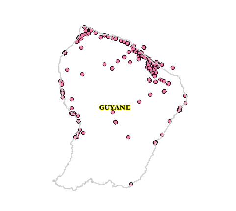

# APICARTO intégration

L'idée : Intégrer dans une base de données PostGIS les jeux de données ouverts et présents sur http://data.gouv.fr pour pouvoir les exploiter :
* Visualiser les données
* Effectuer des traitements SIG
* Croiser les données (enrichissement, contrôle, etc.)
* Exposer des services [apicarto](http://github.com/sgmap/apicarto)

Attention :

* Ce dépôt est utilisé pour l'instant pour de l'expérimentation (la structure de la base va varier)
* Les jeux de données ne sont pas (encore) utilisés dans l'API carto
* La licence de la base produite n'est pas définie


## Vue d'ensemble

Chaque produit est associé à un schéma dans la base de données. Les données (csv, xml, shp, etc.) sont intégrées sous forme de tables :



La base ainsi constituée sert de pivot pour les traitements SIG, l'utilisation dans les systèmes de diffusion et de rendu cartographique (mapserver, geoserver, mapnik), etc.

En bref, les données à l'origine dans des formats hétérogènes sont unifiées dans un même système.


## Exemples de visualisation et croisements de données

Ci-après, quelques exemples de visualisation réalisé à l'aide de QuantumGIS et GeoServer illustrant par exemple la possibilité de calculer facilement les géométries des EPCI, de symboliser les contours d'IRIS, d'exploiter l'annuaire de l'administration, etc.


### L'annuaire de l'administration (DILA) sur fond d'IRIS




Sources : 
* https://www.data.gouv.fr/fr/datasets/service-public-fr-annuaire-de-l-administration-base-de-donnees-locales/
* https://www.data.gouv.fr/fr/datasets/contours-iris/

### La base permanente des équipements (BPE)



Source : https://www.data.gouv.fr/fr/datasets/base-permanente-des-equipements-1/

### IRIS (INSEE/IGN) / Route500 / GEOFLA



Sources :
* https://www.data.gouv.fr/fr/datasets/contours-iris/
* https://www.data.gouv.fr/fr/datasets/geofla-communes/
* https://www.data.gouv.fr/fr/datasets/route-500-572583/


### EPCI avec géométrie GEOFLA



Sources :
* http://www.collectivites-locales.gouv.fr/liste-et-composition-2015
* https://www.data.gouv.fr/fr/datasets/geofla-communes/

### Route500 (troncon de route)



Source : https://www.data.gouv.fr/fr/datasets/route-500-572583/

### Installation radioélectriques de plus de 5 watts (ANFR)




Source : https://www.data.gouv.fr/fr/datasets/donnees-sur-les-installations-radioelectriques-de-plus-de-5-watts-1/


## Import des données dans une base

### Variables d'environnement

Les paramètres de connexion à la base de données sont définis à l'aide des variables classiques de PostgreSQL :

* PGHOST
* PGUSER
* PGPASSWORD

Remarques : 

* PGDATABASE n'est pas supportée pour l'instant. La base doit s'appeler "apicarto".
* Les scripts crééront des schémas dans cette base de données.


### Version courte

```
createdb -E UTF8 apicarto
psql -d apicarto -c "CREATE EXTENSION postgis"
cd datasets
sh import-all.sh
```

### Version longue

* Création de la base de données

```
sudo su postgres
psql -c "CREATE USER apicarto WITH PASSWORD 'secretpassword'"
createdb -E UTF8 -O apicarto  apicarto
psql -d apicarto -c "CREATE EXTENSION postgis"
```

* Import des données

```
cd datasets
PGUSER=apicarto PGPASSWORD=secretpassword sh import-all.sh
```

## Comment intégrer un nouveau jeu de données?

### datasets/[name]/import.sh

* Forker le dépôt
* Ajouter un dossier dans dataset correspondant au jeu de données
* Créer un script "import.sh" qui télécharge les données et les importe dans la base "apicarto"
* Ajouter un fichier .gitignore recensant les données téléchargées (le nettoyage des données téléchargées se repose sur lui)
* Commiter les scripts et lancer une pull request!


### Pourquoi des shells?

* Les scripts shells sont maitrisés par la plupart des DBA postgres/postgis
* Les shells ont la liberté d'appeler les outils de leur choix (exécutable, script python, grunt, jar, etc.)
* ```psql``` supporte nativement les variables d'environnement PGHOST, PGUSER, PGPASSWORD ce qui permet une personnalisation suffisante


## Où trouver les jeux de données?

Il est important d'avoir une URL de téléchargement. De nombreux jeux de données sont recensés sur [data.gouv.fr](https://www.data.gouv.fr/fr/), mais d'autres sites proposent des URL (exemple [page de téléchargement du COG de l'INSEE](http://www.insee.fr/fr/methodes/nomenclatures/cog/telechargement.asp)).


## Quels jeux de données intégrer (ou pas)?

Dans un premier temps, on se concentre sur les jeux de données ayant une couverture France entière (ou presque).

En cas d'intégration de jeux de données régionaux, on veillera à uniformiser les structures.


## Outils disponibles pour les scripts

Le fichier install.sh (TODO) décrit l'installation des outils utilisés dans les scripts d'intégration.

En principe, les outils ci-après suffisent :

* ogr2ogr : Utilitaire de conversion
* shp2pgsql : Intégration d'un shapefile dans PostGIS
* psql : Exécution de script .sql (NB : Permet de travailler avec du CSV et des tables temporaires)

* iconv : Conversion d'encodage
* sed : Principalement pour modifier des entêtes CSV ou lignes problématiques dans les jeux de données


S'il est nécessaire de parser des données, il sera possible d'utiliser :

* python3
* java 1.7 (jar)


## TODO

- [ ] Documentation de l'installation des outils (install.sh)
- [ ] Mettre en place un mécanisme de documentation pour les jeux de données (licence, origine, schéma, lien vers les specs. si existante)
- [ ] Dockerfile ou Vagrant pour démonstration (et windows)
- [ ] Poser un cadre pour les jeux de données protégés par des clés ou mots de passe (variable d'environnement)
- [ ] Voir comment il est possible de récupérer la dernière version d'un jeu de données via l'API de data.gouv.fr (ou demander l'ajout d'une URL latest faisant une redirection sur data.gouv.fr?)
